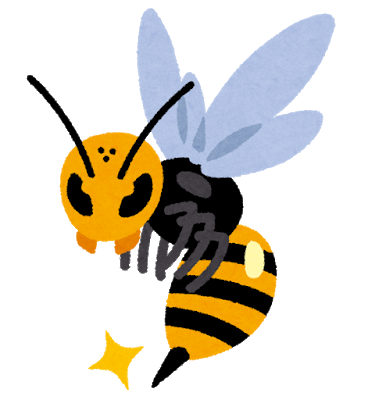
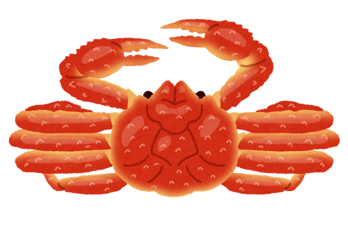
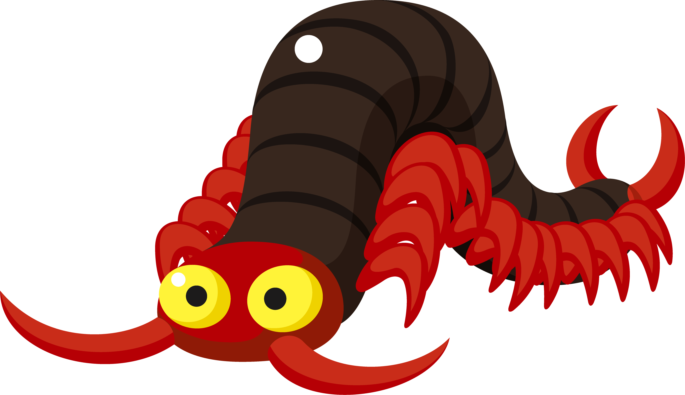
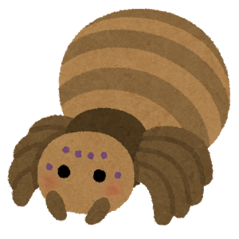

<!-- _class: title -->

# 虫

---
<!-- _class: title -->

## 虫好きですか？

---
<!-- _class: title -->

## 私は嫌いです:tired_face:

---
<!-- _class: title -->

## 敵を知り己を知れば百戦殆うからず:muscle::triumph:

#### "虫"とは何か？
(画像はほとんどないので安心してください)

---

## 節足動物

#### 昆虫≠虫
虫と言えば「昆虫」だけど**ムカデ**や**クモ**など「昆虫」ではない虫も少なくない

ムカデもクモも含んだ大きな外骨格動物の集まりを**節足動物**と呼ぶ

---

<!-- _class: split -->

## 節足動物四天王
#### 1.六脚亜門

#### 2.甲殻亜門

#### 3.多足亜門

#### 4.狭角亜門

---

## 1.六脚亜門

- 昆虫等、主に陸上で繁栄するグループ
- **約4億8000万年前**から地球にいる
    - ちなみにその頃の脊椎動物はまだ硬い骨すら作れてない
- 最初は海棲生物だったとされる
    - つまり**ムカデやクモとは別に上陸して進化してきた**

---

### 昆虫

- **4億4000万年前**に誕生
- **4億年前**には羽を生やして飛んでいた
    - 両生類の上陸はその3000万年後
- とんでもなく多様な進化を遂げていて、**およそ100万種**分類されているとされる
    - 人類の知る生物種のうち半分以上

---

### 昆虫の異能力

- **サナギ**
    - 成長途中で殻を作って**一旦自分の身体を溶かして再構築**して成体になる
    - こんな頭のおかしい生活史は昆虫だけ
- **捕食寄生**
    - 寄生バチや寄生バエなど
    - 単に宿主と共生するのではなく、**宿主を食い殺す**

---

## 2.甲殻亜門

- エビ・カニの類
- 身近な虫の例としてはダンゴムシ
- 六脚類はここから進化した
    - 六脚類に近い甲殻類はミジンコ
    - ほとんどが海棲の甲殻類の中でミジンコは淡水棲
- 現代では六脚類と合わせて**汎甲殻類**と分類される

---

### 地球の覇者ヨコエビ

- 甲殻類の中で最も広く分布する種
- 赤道から北極南極まで全ての海に分布
    - 深海10,000mにもいた
- 温帯・冷帯中心に淡水にも生息してる
- 陸上でも草むらや落ち葉の下にいる

---

## 3.多足亜門

- ムカデ・ヤスデ・ゲジゲジの類
- めちゃめちゃ長くなれる生物で、歴史上2mになるものがいて節足動物史上最大
- 汎甲殻類と合わせて**大顎類**と分類される
    - 最初の節が「触覚」になるのが特徴
    

---

## 4.狭角亜門

- クモ・サソリ・ダニの類
    - カブトガニもここ
    - **クモはアリよりカブトガニに近い**
    - 約5億年前の時点で大顎類と分岐してた別モノ
    - 姿が似てるのは収斂進化の結果だと言われる
- 大顎類と併せて現代の**節足動物**になる

---

### 5.Artiopoda

- もう全滅してる
- 三葉虫とか

---

<!-- _class: title -->

## 調べれば調べるほど節足動物は多様で偉大……

---

<!-- _class: title -->

## キモいものはキモい

## 以上
