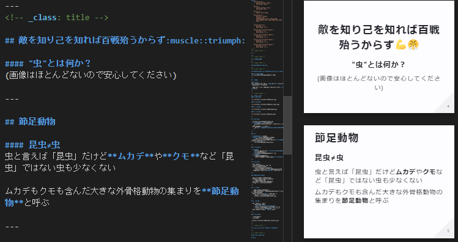

<!-- _class: title -->

# テキストでスライドを作れるようになるまで

---

## Marp導入しました

- Markdown記法でスライドを生成できるやつ
- VSCodeで書ける
    - 拡張入れるとプレビューも出る
- HTMLで出力される
    - CSS等で改造できる
- PDFにも変換できる

---

### 前回のスライドはMarp製です

---

## 実際に出力できるまでの道程

1. VSCode の拡張入れる
1. marp-cli 入れる　←　？？？
1. serve(node.js) 入れる　←　？？？
1. レイアウト調整

---

## 1. VSCodeの拡張入れる

左のメニューから`marp`で検索してインストールするだけ

---

## 2. marp-cli入れる

コマンドで`$ npm install -g @marp-team/marp-cli`するだけなんだけどどうしてそんなことしてるかというと……

- MarpはHTMLを吐く
    - PDF出力はHTMLを変換するのでブラウザが要る
- VSCodeをWSL2上で動かしていたのでMarpもWSL2上
    - WSL2上にブラウザなんてない
    - **PDF出力できない！！**

---

### この工程は本当に必要だったのか……

そもそもVSCodeをWindows側から起動していればよかったのでは？

とにかく急いでいたので余裕がなかった

---

## 3. serve(node.js)入れる

コマンドで`$ serve`と打つだけでカレントディレクトリをホームとするサーバーが立ち上がる便利なやつ
なんでそんなものが必要になったかというと……

- セキュリティ的にブラウザがローカルのファイル参照するのは規制される
    - 出力したら画像が消えてしまった……
- 画像アップロードしてリンクし直すのは面倒だったので

---

### この工程は本当に必要だったのか……

そもそもPDF出力する必要性はあったのか？　tackmanさんのようにHTML形式でアップして公開すれば良かったのでは？

とにかく急いでいたので余裕がなかった

---

## 4. レイアウト調整

CSS を編集してやりたいようにした

4-1. 中央寄せと左寄せ
4-2. 縦割り

---

### 4-1. 中央寄せと左寄せ

- レイアウトの設定はページ全体に反映されてしまう
- ページ毎に`class`を設定できるのでそこを変えて対応

---

### 4-2. 縦割り

- Marp は **Markdown の"文章の構造化"という理念を守っている** :thumbsup:
  - 代償として**2次元配置の概念が無い**
- 最近の HTML にはグリッドレイアウトというものがあるのでそれを活用
  - グリッドレイアウトはパーツ毎にZ字の順で埋まっていくので工夫が必要
  - H4タグをタイトルとして特別扱いすることで解決

---

<!-- _class: title -->

### 完全勝利

(他にも3列割も出来る)

---

#### こんな感じ
 

---

<!-- _class: title -->

## 以上です
